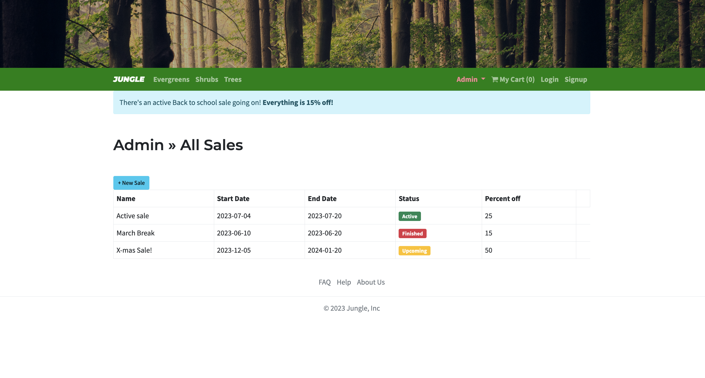

# Jungle

A mini e-commerce application built with Rails 6.1 for purposes of teaching Rails by example.

## Run the project

To start the Rails server use:
```
bin/rails server -b 0.0.0.0
```
 Have terminal tab open within the Jungle application directory

 Then open browser on `http://localhost:3000/` to run the project.

## Setup

1. Run `bundle install` to install dependencies
2. Create `config/database.yml` by copying `config/database.example.yml`
3. Create `config/secrets.yml` by copying `config/secrets.example.yml`
4. Run `bin/rails db:reset` to create, load and seed db
5. Create .env file based on .env.example
6. Sign up for a Stripe account
7. Put Stripe (test) keys into appropriate .env vars
8. Run `bin/rails s -b 0.0.0.0` to start the server

## Database

If Rails is complaining about authentication to the database, uncomment the user and password fields from `config/database.yml` in the development and test sections, and replace if necessary the user and password `development` to an existing database user.

## Stripe Testing

Use Credit Card # 4111 1111 1111 1111 for testing success scenarios.

More information in their docs: <https://stripe.com/docs/testing#cards>

## Dependencies

- Rails 6.1 [Rails Guide](http://guides.rubyonrails.org/v6.1/)
- Bootstrap 5
- PostgreSQL 9.x
- Stripe
## Screenshots of Application
###  Main page


###  Admin categories


### Admin Dashboard


### Admin Products


### Admin Sales


### About Us


### Login Form


### As Login User


### SignUp Form


### My Cart


### Products


### Payment


### Thank you for your order!


